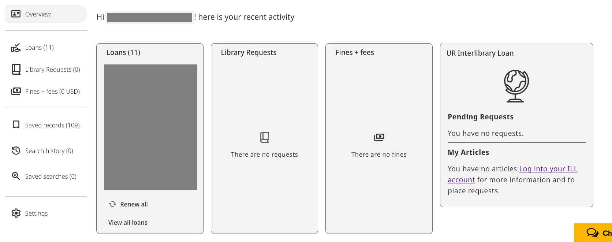
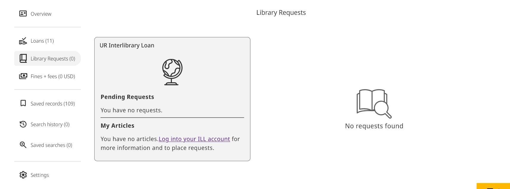
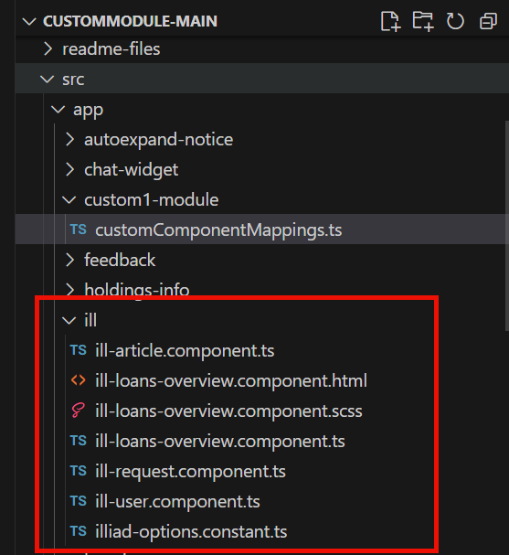
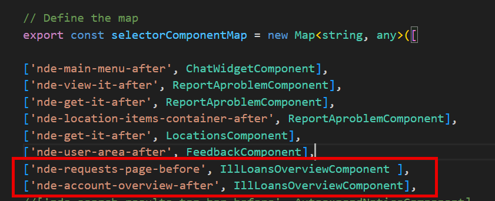

# Ex-Libris-NDE-ILLiad-My-Account-Integration
Based on the functionality of the [primo-explore-my-ill](https://github.com/alliance-pcsg/primo-explore-my-ill) plugin for Primo VE, this add-on is designed for use with the new Ex Libris NDE interface.

## Features
Creates a pane in Primo NDE "My Library Account" Overview section. This can also be added to the Library Requests section or any other desired location prefixed with the <nde...> tag. Queries ILLiad for user's current requests and received articles, and displays them in the pane, including direct links to articles.

## Screenshot


## Install

1. Setup and configure your local developer environment and follow the instructions on [Ex Libris' customModule Github project page](https://github.com/ExLibrisGroup/customModule).

2. In your IDE, copy the ill folder to src/app

3. Copy the files in the project services folder to src/services



4. Map selectors to the custom1-module/customComponentMappings.ts file: 
```
['nde-requests-page-before', IllLoansOverviewComponent ],
['nde-account-overview-after', IllLoansOverviewComponent],
```


5. Modify the htaccess and illiad.php files and deploy them to a local server.

6. Update the src/app/ill/illiad-options.constant.ts file with your local data.
